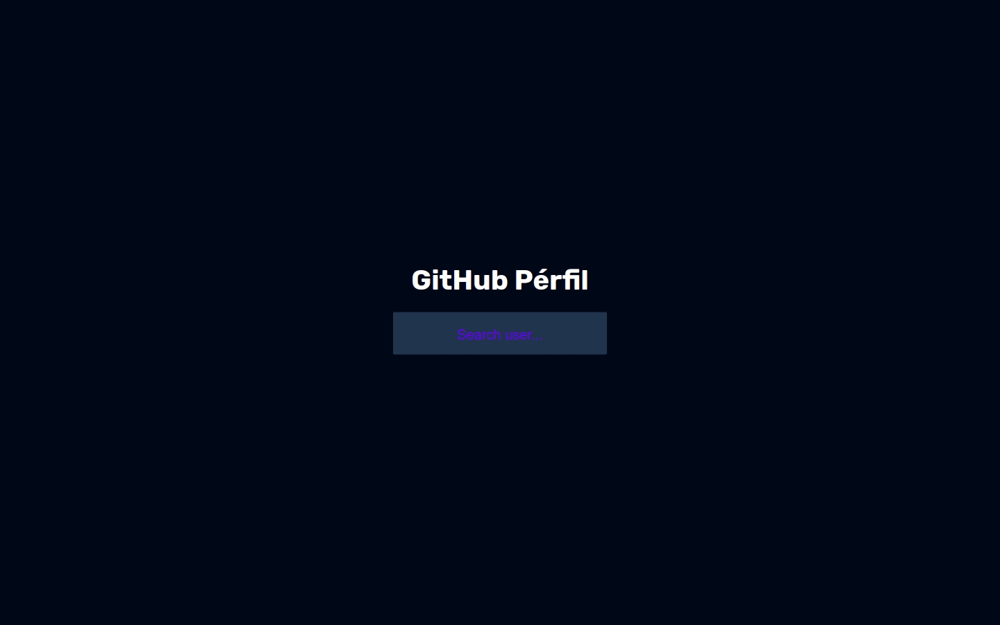

# GitHub Perfil

This is a solution to the [Florin Pop App Ideas Challenge](https://github.com/florinpop17/app-ideas/blob/master/Projects/2-Intermediate/GitHub-Profiles.md).

## Table of contents

- [Overview](#overview)
  - [The challenge](#the-challenge)
  - [Screenshot](#screenshot)
  - [Links](#links)
- [My process](#my-process)
  - [Built with](#built-with)
  - [Useful resources](#useful-links-and-resources)
- [Author](#author)
- [Acknowledgments](#acknowledgments)

## Overview

## The Challenge

- [ ] User can enter a username
- [ ] User can click on search button to retrieve information
- [ ] User can see the avatar, username, followers and repository count of searched user
- [ ] User can see all repositories of searched user
- [ ] User should get an alert if the username is not valid

To get data from API you can check [fetch API](https://developer.mozilla.org/en-US/docs/Web/API/Fetch_API/Using_Fetch) in javascript

### Screenshots

### Links

- [Code URL](https://github.com/blade-01/js-projects/tree/github-profile)
- [Live URL](https://git-perfil.netlify.app)

## My process

### Built with

- Semantic HTML5 markup
- CSS
- Flexbox Grid
- Mobile-first workflow

### Useful links and resources

To get the data you need to communicate with GitHub API. you can either

- [Read Docs](https://developer.github.com/v3/)
- [Check API directly](https://api.github.com/users/chaharshivam)
- [ResponsivelyApp](https://responsively.app) - This extension helped me in viewing my projects in every viewport which helped improve the responsiveness of the game.

## Author

- Website - [Animashaun Taofiq T.](https://www.github.com/blade-01)
- Twitter - [@dr_annys](https://www.twitter.com/dr_annys)

## Acknowledgments

Well, I'd like to thank Florin Pop for creating [this](https://github.com/florinpop17/app-ideas) amazing repo. Gracias 🙇
