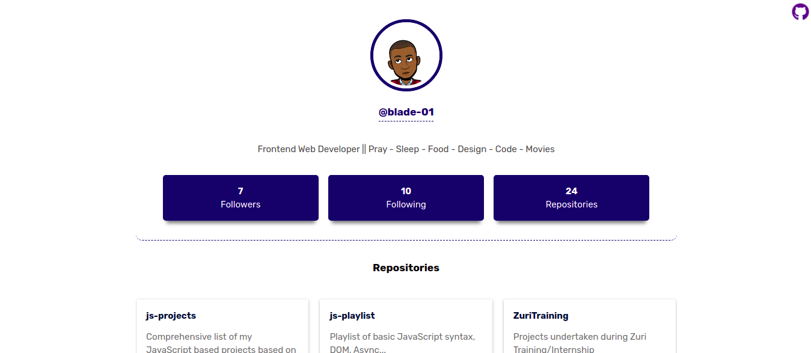

# Cloudbase

This is my actual first use of API calls and destructuring.

## Table of contents

- [Overview](#overview)
  - [The challenge](#the-challenge)
  <!-- - [Screenshot](#screenshot) -->
  - [Links](#links)
- [My process](#my-process)
  - [Built with](#built-with)
  - [Useful resources](#useful-links-and-resources)
- [Author](#author)

## Overview

## The Challenge

- [ ] User can enter a location
- [ ] User can click on enter to retrieve information
- [ ] User can see the location, date, time, weather icon of searched location
- [ ] User can see all the app changing backgound based on the time of the day
- [ ] User should get an alert if the location entered is not valid

To get data from API you can check [fetch API](https://developer.mozilla.org/en-US/docs/Web/API/Fetch_API/Using_Fetch) in javascript.

<!-- ### Screenshots

 -->

### Links

- [Code URL](https://github.com/blade-01/js-projects/tree/weather-app)
- [Live URL](https://cloudbase.netlify.app)

## My process

### Built with

- Semantic HTML5 markup
- CSS
- Mobile-first workflow

### Useful links and resources

To get the data you need to communicate with GitHub API. you can either

- [Read Docs](https://www.openweathermap.org)

## Author

- Website - [Animashaun Taofiq T.](https://www.github.com/blade-01)
- Twitter - [@dr_annys](https://www.twitter.com/dr_annys)
